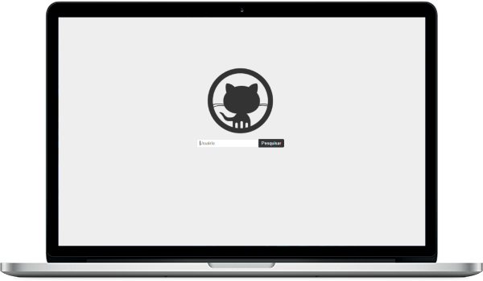

<h1 align="center" id="topo">Search GitHub User </h1>

<div align="center">

</div>

### 💻 Projeto

O projeto Search GitHub User - Pesquisar Perfil GitHub - é um projeto para exercitar os conceitos dados no curso de React.js do **Programa Hiring Coders #3** da VTEX em parceria com a Gama Academy.

Digitando um nome de usuário do Github, a aplicação busca os repositórios desse usuário e os exibem em outra página.

[Clique aqui](https://github.com/brseghese/hiring-coders-3-vtex-gama/tree/main/d1_react)🔗 para acessar o repositório com a introdução do curso.

---

### 🔧 Ferramentas

O projeto foi desenvolvido com as seguintes ferramentas:

#### 🧪 Tecnologias

- [React.js](https://pt-br.reactjs.org/)
- GraphQl

#### 📚 Dependências

- [React-Router-DOM](https://reactrouter.com/)
- styled-components
- axios
- API GitHub

---

### 🚀 ​ [Clique aqui](https://hc3-search-rep-github.netlify.app/)🔗 e veja a aplicação no ar.


---

### ​👷‍♂️​ Acessar o Projeto

<a href="https://github.com/brseghese/hc3-search-github-user/tree/main">Acesse aqui</a>🔗 o código fonte pelo GitHub.

Faça o <a href="https://github.com/brseghese/hc3-search-github-user/archive/refs/heads/main.zip">Download aqui</a>🔗 do código fonte no formato zip.

Clone o repositório:

```
git clone https://github.com/brseghese/hc3-search-github-user.git
```

Entre na pasta do projeto:

```
cd hc3-search-github-user
```

Instale as dependências:

```
npm install
```

Execute a aplicação:

```
npm run start
```

Abra http://localhost:3000 no seu navegador para ver a aplicação

---

### 📝 Resumo - Preparação do Ambiente

Instalando o [React App](https://create-react-app.dev/)🔗

```
npx create-react-app nome_do_projeto
```

Instalando o [AXIOS](https://axios-http.com/ptbr/docs/intro)🔗

```
npm i axios
```

Requisitando a [API GitHub](https://api.github.com/)🔗 com axios.

Instalando o [React Router Dom](https://v5.reactrouter.com/web/guides/quick-start)🔗

```
npm i react-router-dom
```

Instalando o [Style Components](https://styled-components.com/)🔗

```
npm i styled-components
```

---

### ​​📘​​ Sugestão de Estudos

- React Context API
- Redux
- Next.js

---

### 📝 License

Esse projeto é licenciado pela MIT License. Veja mais detalhes por [aqui](https://pt.wikipedia.org/wiki/Licen%C3%A7a_MIT)

---

### ✒️ Autor

<a href="https://github.com/brseghese">  </a>

[Clique aqui](https://brseghese.github.io)🔗 e acesse meu portfólio! 💼 (em construção...)

---

#### 💬 Sinta-se a vontade para entrar em contato

[](https://www.linkedin.com/in/brunoseghese/) [](https://github.com/brseghese) [](mailto:brseghese@gmail.com)

---

> Desenvolvido com ❤️ por **Bruno Seghese**

---
